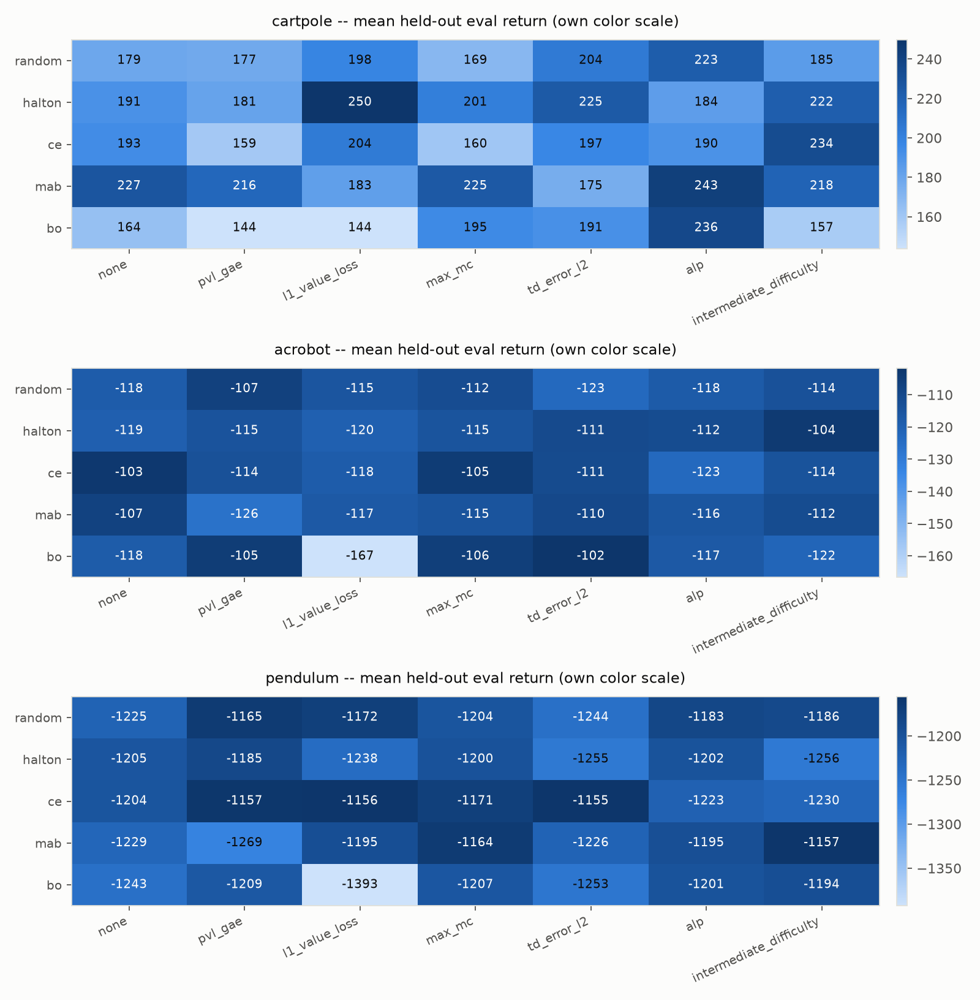
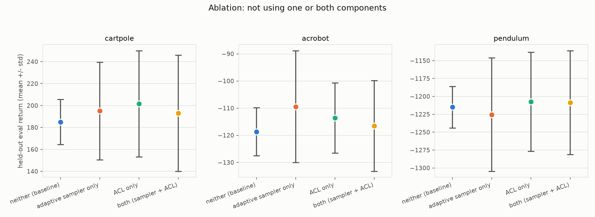

# verifai-acl-mixmatch

Mix-and-match testing of **Scenic-mediated VerifAI samplers** (random,
quasi-random Halton, cross-entropy, multi-armed bandit, simulated
annealing) against **Automatic Curriculum Learning (ACL) learning-potential
functions** (the current GAE/PVL score, five alternatives from the
curriculum-learning literature, and a "none" ablation), run on three fast
classic-control environments (CartPole, Acrobot, Pendulum) so the full grid
can actually be trained end-to-end instead of just designed on paper.

This is a from-scratch re-implementation, not a fork: it takes the
*architecture* of [vitgruib/SIPACL](https://github.com/vitgruib/SIPACL) -- a
Scenic/MetaDrive driving policy trained under a Prioritized-Level-Replay
(PLR) curriculum, where Scenic scenes are sampled through VerifAI and a
GAE-based "Positive Value Loss" (PVL) score decides what to replay -- and
swaps the expensive simulator for three classic-control environments so many
sampler x potential-function combinations fit in one sitting, per the
explicit ask to keep testing in "simple, fast environments, like CartPole"
and to cover a few environments including ones with a more complex feature
space.

## Architecture, and how it maps back to SIPACL

| SIPACL (Scenic + MetaDrive)                              | This repo                                   |
|-----------------------------------------------------------|----------------------------------------------------------|
| Scenic program samples a driving *scene* (traffic, weather, geometry) | Scenic program samples a *physics task*: CartPole (5 params), Acrobot (6), Pendulum (5) |
| `scenic.scenarioFromFile(..., params={"verifaiSamplerType": ...})` | The exact same call (`acl_bench/scenic_sampling.py`), just against a model-less `.scenic` file (`acl_bench/scenic_scenarios/*.scenic`) instead of a MetaDrive model |
| `MetaDriveEnv` keeps a disk-backed PLR buffer of scenes, replay probability `replay_resample_prob` | `acl_bench.curriculum.plr.PLRCurriculum` keeps the same buffer in memory (a task here is 5-6 floats, not a serialized world) |
| `_lp_delta`: mean(max(GAE_delta, 0)) -- Positive Value Loss | `acl_bench.potential.functions.pvl_gae`, ported near line-for-line, plus 5 alternatives and a "none" ablation (below) |
| PPO (CleanRL-style, continuous control) | Same PPO structure, generalized to discrete (CartPole, Acrobot) and continuous (Pendulum) actions |

Two independent knobs, "mixed and matched" as a grid, plus the question of
whether they should even share a feedback signal:

- **Sampler** -- how a *brand-new* task is proposed from the parameter space.
- **Potential function** -- how an *already-seen* task is scored for
  replay-worthiness, *and* (see below) what feeds back into the sampler.

## Is the sampler's feedback the same function as ACL's replay score?

It is, by design here, and that's a deliberate choice worth spelling out.
VerifAI's active samplers (cross-entropy, the bandit, simulated annealing)
all expect one scalar `rho` per proposed task -- STL-robustness-flavored:
lower/negative means "counterexample, worth exploring more of this region."
Rather than invent a second, independent notion of "how good was that task"
purely to drive the sampler, `acl_bench.curriculum.plr.PLRCurriculum` reuses
whichever potential function is under test for both jobs: the same raw score
that ranks a task for replay is z-scored against a running mean/std
(`RunningNormalizer`, Welford's algorithm) and negated into `rho`, so a task
the ACL side considers "still worth learning from" is exactly the region the
sampler is nudged toward proposing more of. One function, two consumers.
This also sidesteps needing a per-environment reward-scale constant --
CartPole's ~100s-scale returns and Pendulum's ~1000s-scale penalties
normalize the same way.

The **"none"** condition in the grid turns this off along with everything
else ACL does (see the ablation section below): with no potential function
to reuse, the sampler falls back to raw (still z-scored) episode return, and
there is no replay buffer at all.

## Samplers under test, and why not all 8

[VerifAI](https://github.com/BerkeleyLearnVerify/VerifAI) (`pip install
verifai`) ships 8 sampler types reachable from `FeatureSampler.*For`. We
route every one of them **through Scenic** (`param verifaiSamplerType = ...`
on a `.scenic` file, resolved by `verifai.server.choose_sampler` --
`acl_bench/scenic_scenarios/*.scenic`), exactly matching SIPACL's own
`scenic.scenarioFromFile(..., params={"verifaiSamplerType": ...})` call, just
without a MetaDrive/CARLA model attached (Scenic doesn't need one just to
sample scalars -- see `verifai.core.external_params`'s own docstring). Tested
each of the 8 directly before deciding which are actually usable in an
open-ended training loop:

| Sampler | In the grid? | Why |
|---|---|---|
| `random` | Yes | Baseline: i.i.d. uniform, ignores all feedback. |
| `halton` | Yes | Quasi-random low-discrepancy sequence; covers the space more evenly than i.i.d. for the same draw count, still ignores feedback. |
| `ce` (cross-entropy) | Yes | Refits a distribution toward low-`rho` regions each round. |
| `mab` (multi-armed bandit) | Yes | Discretizes each dimension into buckets, runs UCB1 toward buckets with a history of low `rho`. |
| `sa` (simulated annealing) | Yes | A single-chain local search that proposes near its last accepted task and cools over time. Works when called directly, but `verifai.server.choose_sampler` has no branch for it, so `verifaiSamplerType='sa'` can't select it; it is injected through Scenic's documented `externalSampler` global parameter instead (`SimulatedAnnealingSampler` in `scenic_sampling.py`), so it still goes through the same `generate(feedback=...)` loop. |
| `bo` (Bayesian optimization) | No (dropped) | Worked, but its GP refit grew with the run's task history and consumed **83% of the first grid's 131 minutes** (mean 227s per CartPole run vs. ~5s for every other sampler), plus two fragile dependencies (`GPyOpt`+`GPy`, and a `setuptools<81` pin). Replaced by `sa`. The results below are from that first grid and still include it. |
| `eg` (epsilon-greedy) | No | Raises `NotImplementedError: tried to use abstract BoxSampler` in the installed VerifAI release, called directly or through Scenic. Broken upstream, not a bug here. |
| `grid` | No | Exhaustive by design -- terminates once its resolution is covered, and even before that, 300 samples over our 5D box took 17s. The wrong tool for an open-ended training loop, not broken. |

So "all applicable" = **5 samplers**: random, halton, ce, mab, sa.

## Learning-potential (feedback) functions under test

The buffer always does rank-based prioritized replay --
`P(i) ~ 1/rank_i^0.9` (Prioritized Level Replay, Jiang, Grefenstette &
Rocktaschel, ICML 2021) -- and EMA-smooths whatever raw score a function
below returns into that slot's running priority, exactly as SIPACL's
`_compute_learning_progress` does.

| Function | Idea | Source |
|---|---|---|
| `pvl_gae` (**current/default**) | mean(max(GAE advantage, 0)) -- "how much is the critic still surprised, in the direction of doing-better-than-expected" | Schulman et al., *GAE*, 2016; SIPACL's own `_lp_delta` |
| `l1_value_loss` | mean(\|GAE advantage\|) -- surprise in either direction, not just positive | Jiang et al., *Prioritized Level Replay*, ICML 2021 |
| `max_mc` | mean(max(Monte-Carlo return - V(s), 0)) -- uses the actual discounted return instead of a bootstrapped target, so it isn't distorted by a miscalibrated critic | Jiang et al., *Replay-Guided Adversarial Environment Design* (Robust PLR), NeurIPS 2021 |
| `td_error_l2` | mean squared one-step TD error -- the classic "surprise" signal | Schaul et al., *Prioritized Experience Replay*, ICLR 2016 |
| `alp` | \|episode return now - EMA of returns on this exact task\| -- score *change*, not magnitude | Portelas, Colas et al., *ALP-GMM*, CoRL 2020 |
| `intermediate_difficulty` | `1 - 2*|success_rate - 0.5|`, peaking when a task is solved about half the time -- neither trivial nor hopeless | Florensa et al., *Reverse Curriculum Generation*, 2017; Wang et al., *POET*, 2019; Du et al., *VACL*, 2022 |
| `none` | **Ablation**: no potential function, no replay buffer -- every episode is a fresh domain-randomization draw from the sampler; the sampler's feedback (if it uses any) falls back to raw return. | -- |

## Isolating "not using one or both"

The grid crosses 5 samplers x 7 potential-function conditions, which already
contains every ablation cell without a separate flag:

- **Neither** = a non-adaptive sampler (`random`/`halton`) + `potential_fn="none"` -- plain domain randomization, no curriculum sophistication at all.
- **Adaptive sampler only** = `ce`/`mab`/`sa` + `potential_fn="none"` -- VerifAI steers new tasks toward regions with low raw-return feedback, but nothing ever gets replayed.
- **ACL only** = `random`/`halton` + a real potential function -- new tasks are plain domain randomization, but the PLR buffer replays by learning potential.
- **Both** = `ce`/`mab`/`sa` + a real potential function -- the full mix-and-match combination, feedback unified as described above.

`acl_bench/plot_results.py` renders this 2x2 explicitly (averaging over the
6 real potential functions for "ACL"/"both", and over `ce`/`mab`/`sa` for
"adaptive sampler") per environment.

## Environments

All three are Gymnasium `classic_control` envs (no Box2D -- fast), with
physical parameters exposed as task variables:

| Env | Task params (bounds) | Action space | Role |
|---|---|---|---|
| CartPole | pole half-length (0.25-1.5m), pole mass (0.05-0.5kg), cart mass (0.5-2.0kg), push force (4-16N), init-state range (0.05-0.3) | Discrete(2) | Simple baseline |
| Acrobot | link lengths x2 (0.5-1.5m), link masses x2 (0.5-1.5kg), link moment of inertia (0.5-1.5), torque noise (0-0.3) | Discrete(3) | **Complex feature space** (6D) -- chaotic double-pendulum swing-up |
| Pendulum | gravity (5-15), mass (0.5-2.0kg), length (0.5-2.0m), max torque (1-4 N.m), max angular speed (4-12 rad/s) | Box(1) continuous | Continuous-action control; max_torque being sampled means the policy's action bounds change per task |

Episodes truncate at each env's standard `-v1` length (CartPole/Acrobot 500
steps, Pendulum 200) -- the raw Gymnasium classic-control classes have no
built-in cap outside their registered `-v1` `TimeLimit` wrapper, so this is
applied explicitly in the training loop.

## Running it

```bash
python -m venv .venv && source .venv/bin/activate
pip install -r requirements.txt

# one combination
python -c "
from acl_bench.experiment import run_one, make_fixed_eval_set
from acl_bench.ppo import PPOConfig
row = run_one('acrobot', 'mab', 'max_mc', seed=1,
               cfg=PPOConfig(total_timesteps=60_000),
               eval_set=make_fixed_eval_set('acrobot'))
print(row)
"

# the full 3 (envs) x 5 (samplers) x 7 (potential-fn conditions) x 3 (seeds) grid
python -m acl_bench.experiment --seeds 1 2 3 --total-timesteps 60000

# charts used below
python -m acl_bench.plot_results
```

Each run trains a small MLP PPO agent (two 64-unit tanh layers, actor +
critic; Categorical head for CartPole/Acrobot, tanh-squashed Gaussian for
Pendulum) for 60,000 environment steps under one (env, sampler,
potential-function) curriculum, then evaluates the final policy on a fixed,
sampler-independent set of 15 held-out task configurations (3 episodes each)
-- so every cell of the grid is scored on the same yardstick, not on tasks
its own curriculum happened to pick.

## Results

> **Status:** everything in this section comes from the *first* grid, which
> used Bayesian optimization (`bo`) instead of the `sa` sampler that now
> replaces it, and a fixed 60k-step budget. Convergence runs to choose a
> defensible budget, and a re-run of the grid with `sa`, are the next steps.

Full grid: 3 envs x 5 samplers x 7 potential-function conditions x 3 seeds =
315 runs, 60k environment steps each, ~131 minutes of total compute on a
laptop CPU, of which **83% was Bayesian optimization alone** (mean 227s per
CartPole run, 62s Acrobot, 20s Pendulum, versus ~5.5s for every other
sampler). Raw data: [`results/grid_results.csv`](results/grid_results.csv).

**Headline: at this budget, nothing separates from noise.** The 2x2 ablation
below compares each condition to "neither" (a non-adaptive sampler, ACL off)
with Welch's t-test on per-run held-out eval return:

| env | neither | adaptive sampler only | ACL only | both |
|---|---|---|---|---|
| cartpole (higher better) | 185.0 (n=6) | 195.1, +10.1, p=0.57 (n=9) | 201.6, +16.6, p=0.17 (n=36) | 192.9, +7.9, p=0.49 (n=54) |
| acrobot (higher better) | -118.7 (n=6) | -109.4, +9.3, p=0.26 (n=9) | -113.7, +5.1, p=0.26 (n=36) | -116.6, +2.2, p=0.62 (n=54) |
| pendulum (higher better) | -1215.1 (n=6) | -1225.5, -10.4, p=0.73 (n=9) | -1207.4, +7.7, p=0.65 (n=36) | -1208.7, +6.4, p=0.68 (n=54) |

Every difference is small next to the seed-to-seed spread (mean within-cell
SD: CartPole 43, Acrobot 11, Pendulum 58), and none is close to significant.
CartPole's "ACL only" is the largest gap (+16.6, p=0.17), and even that is
well inside the noise. The p-values are unadjusted for the nine comparisons,
so they, if anything, flatter these results. The honest reading is *no
detectable effect from either component, alone or combined*, not "they
don't work": with 3 seeds per cell and only 6 runs in the baseline group,
this grid could only have detected large effects.

**Don't read the best/worst heatmap cells as findings.** Each cell is the
mean of 3 runs with a per-cell SD of ~43 on CartPole, so with 105 cells per
env the extremes (e.g. `halton` + `l1_value_loss` at 250 on CartPole, or
`bo` + `l1_value_loss` at -167 on Acrobot and -1393 on Pendulum) are what you
would expect from selection noise alone. The one thing worth a re-run before
believing anything is `l1_value_loss` paired with `bo`, which is the worst
cell in all three environments -- that consistency is at least suggestive,
though it could still be coincidence at n=3.

**Pendulum did not learn.** Every cell sits near -1200, about where an
untrained policy scores; converged PPO policies reach roughly -200 to -400 and
typically need far more than 60k steps to get there. Pendulum comparisons at
this budget are noise and shouldn't count as evidence either way. Acrobot did
learn (about -110, versus -500 for a policy that never reaches the goal), and
CartPole partially did (~190 of a possible 500, averaged over held-out tasks
that include physically hard configurations).

**One real signal: adaptive samplers concentrate their proposals.** Mean
per-dimension std of sampled task parameters (normalized; 0.289 is the
uniform-random ceiling): `random` 0.288, `halton` 0.285, `mab` 0.274, `ce`
0.237, `bo` 0.225. Cross-entropy and Bayesian optimization measurably
narrow where new tasks come from, as intended -- so the lack of a
performance effect isn't because the samplers behave identically. (An
earlier version of this repo, which fed the sampler a separate return-based
signal instead of the unified potential-function score, showed no diversity
difference at all between random, Halton and the bandit.)

<picture>
  <source media="(prefers-color-scheme: dark)" srcset="results/heatmap_dark.png">
  
</picture>

<picture>
  <source media="(prefers-color-scheme: dark)" srcset="results/ablation_dark.png">
  
</picture>

## Limitations

This is a fast proof-of-concept sweep, not a statistically rigorous
benchmark: 3 seeds per cell, 60k environment steps per run, and a single
architecture/hyperparameter setting carried over from SIPACL's own PPO
rather than tuned per combination or per environment. Bayesian optimization,
used in this grid, was dropped afterward: its GP refit grew with the run's
task history (30ms/sample at 30 samples to over 100ms/sample by 120 in
isolation; a mean 227s per full CartPole run in the grid vs. ~5s for the other
samplers) and was the bottleneck, not the RL training itself. Pendulum did not
learn at 60k steps, so its results carry no information; the "neither"
baseline has only 6 runs per env versus 36-54 for the other ablation cells
(minimum detectable effect at that sample size is ~1.2 SD -- see
`python -m acl_bench.timing_report`); and the p-values above are unadjusted
for multiple comparisons. A stronger version of this study needs a step
budget matched to each environment's convergence (see
`acl_bench/convergence.py`) and more seeds on the cheap conditions. Treat the
numbers as a working prototype's first read, not final answers -- the
framework (`acl_bench/scenic_sampling.py`, `acl_bench/potential/functions.py`,
`acl_bench/curriculum/plr.py`, `acl_bench/envs/registry.py`) is built so
that re-running with a larger budget, more seeds, more environments, or
SIPACL's actual MetaDrive/Scenic stack is a config change, not a rewrite.

## Layout

```
acl_bench/
  envs/
    param_cartpole.py, param_acrobot.py, param_pendulum.py   task-parameterized gym envs
    registry.py                                              ties envs to their .scenic files + specs
  scenic_scenarios/*.scenic       one Scenic file per env, VerifaiRange-declared task params
  scenic_sampling.py              Scenic-mediated sampler loader + the generate()/feedback loop
  potential/functions.py          the 6 learning-potential/feedback functions + the "none" ablation
  curriculum/plr.py               PLR replay buffer, unifying sampler feedback and replay score
  ppo.py                          PPO training loop (SIPACL-style, discrete + continuous actions)
  experiment.py                   env x sampler x potential-fn x seeds grid runner -> results/grid_results.csv
  convergence.py                  long single-env runs with periodic held-out eval -> learning curves
  timing_report.py                compute breakdown + signal-vs-noise tables for a grid CSV
  plot_results.py                 renders the charts above
results/                          grid_results.csv + generated charts (checked in)
```
