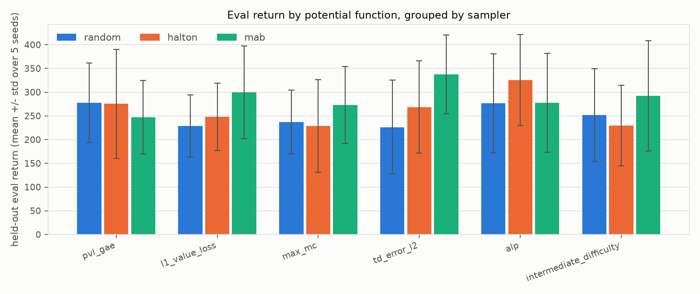

# verifai-acl-mixmatch

Mix-and-match testing of **VerifAI's falsification samplers** (random,
quasi-random Halton, multi-armed bandit) against **Automatic Curriculum
Learning (ACL) learning-potential functions** (the current GAE/PVL score,
plus five alternatives pulled from the curriculum-learning literature), run
on a fast, parameterized CartPole so the full 3 x 6 grid can actually be
trained end-to-end instead of just designed on paper.

This is a from-scratch re-implementation, not a fork: it takes the
*architecture* of [vitgruib/SIPACL](https://github.com/vitgruib/SIPACL) --
a Scenic/MetaDrive driving policy trained under a Prioritized-Level-Replay
(PLR) curriculum, where VerifAI proposes new scenes and a GAE-based
"Positive Value Loss" (PVL) score decides what to replay -- and swaps the
expensive simulator for CartPole so many sampler x potential-function
combinations fit in one sitting, per the explicit ask to keep testing in
"simple, fast environments, like CartPole."

## Why CartPole, and how it maps back to SIPACL

| SIPACL (Scenic + MetaDrive)                              | This repo (CartPole)                                   |
|-----------------------------------------------------------|----------------------------------------------------------|
| Scenic program samples a driving *scene* (traffic, weather, geometry) | VerifAI `FeatureSpace` samples 5 physics params: pole length, pole mass, cart mass, force magnitude, initial-state range |
| `scenic.scenarioFromFile(..., params={"verifaiSamplerType": ...})` | `acl_bench.samplers.make_sampler("random" \| "halton" \| "mab")`, calling the *same* `verifai.samplers.feature_sampler.FeatureSampler.*For` factories |
| `MetaDriveEnv` keeps a disk-backed PLR buffer of scenes, replay probability `replay_resample_prob` | `acl_bench.curriculum.plr.PLRCurriculum` keeps the same buffer in memory (a CartPole task is 5 floats, not a serialized world) |
| `_lp_delta`: mean(max(GAE_delta, 0)) -- Positive Value Loss | `acl_bench.potential.functions.pvl_gae`, ported near line-for-line, plus 5 alternatives (below) |
| PPO (CleanRL-style, continuous control) | Same PPO structure, adapted to CartPole's `Discrete(2)` action space |

Two independent knobs, "mixed and matched" as a 3x6 grid:

- **Sampler** -- how a *brand-new* task is proposed from the parameter space.
- **Potential function** -- how an *already-seen* task is scored for
  replay-worthiness.

## VerifAI samplers under test

[VerifAI](https://github.com/BerkeleyLearnVerify/VerifAI) (`pip install
verifai`) was built to drive falsification search over Scenic scenarios: a
`FeatureSpace` describes a scenario's parameters, a `FeatureSampler`
proposes points in it, the scenario runs, and a scalar robustness value
`rho` (STL semantics: `rho < 0` means a specification was violated) is fed
back via `sampler.update(sample, info, rho)`. We reuse that exact API and
feed it `rho = 2 * (episode_return / max_return) - 1`, so a policy that is
still failing on a task reads as `rho < 0` -- a "counterexample" in VerifAI's
terms, and precisely the region an ACL curriculum wants to keep sampling.
That mapping is the actual bridge between "verifAI sampling" and "ACL" this
repo is testing.

- **`random`** -- `FeatureSampler.randomSamplerFor`. Uniform i.i.d. draws; the baseline.
- **`halton`** -- `FeatureSampler.haltonSamplerFor`. A quasi-random low-discrepancy
  sequence (`verifai.samplers.halton`) that covers the space more evenly than
  i.i.d. random sampling for the same number of draws -- classic
  variance-reduction, ignores feedback entirely.
- **`mab`** -- `FeatureSampler.multiArmedBanditSamplerFor`. Discretizes each
  continuous dimension into buckets and runs a UCB1-style bandit
  (`verifai.samplers.multi_armed_bandit.ContinuousMultiArmedBanditSampler`)
  that steers future draws toward buckets with a history of low `rho`
  (i.e. where the policy is still failing) -- the only one of the three that
  actually uses feedback to shape *where new tasks come from*, as opposed to
  only shaping *which old tasks get replayed*.

## Learning-potential (feedback) functions under test

The buffer always does rank-based prioritized replay --
`P(i) ~ 1/rank_i^0.9` (Prioritized Level Replay, Jiang, Grefenstette &
Rocktaschel, ICML 2021) -- and EMA-smooths whatever raw score a function
below returns into that slot's running priority, exactly as SIPACL's
`_compute_learning_progress` does. Only the raw per-episode score changes:

| Function | Idea | Source |
|---|---|---|
| `pvl_gae` (**current/default**) | mean(max(GAE advantage, 0)) -- "how much is the critic still surprised, in the direction of doing-better-than-expected" | Schulman et al., *GAE*, 2016; SIPACL's own `_lp_delta` |
| `l1_value_loss` | mean(\|GAE advantage\|) -- surprise in either direction, not just positive | Jiang et al., *Prioritized Level Replay*, ICML 2021 |
| `max_mc` | mean(max(Monte-Carlo return - V(s), 0)) -- uses the actual discounted return instead of a bootstrapped target, so it isn't distorted by a miscalibrated critic | Jiang et al., *Replay-Guided Adversarial Environment Design* (Robust PLR), NeurIPS 2021 |
| `td_error_l2` | mean squared one-step TD error -- the classic "surprise" signal | Schaul et al., *Prioritized Experience Replay*, ICLR 2016 |
| `alp` | \|episode return now - EMA of returns on this exact task\| -- score *change*, not magnitude | Portelas, Colas et al., *ALP-GMM*, CoRL 2020 |
| `intermediate_difficulty` | `1 - 2*|success_rate - 0.5|`, peaking when a task is solved about half the time -- neither trivial nor hopeless | Florensa et al., *Reverse Curriculum Generation*, 2017; Wang et al., *POET*, 2019; Du et al., *VACL*, 2022 |

## The environment

`acl_bench/envs/param_cartpole.py` subclasses Gymnasium's `CartPoleEnv` and
exposes five physics parameters as the task space (bounds in parentheses):
pole half-length `(0.25, 1.5)` m, pole mass `(0.05, 0.5)` kg, cart mass
`(0.5, 2.0)` kg, push force `(4, 16)` N, and initial-state perturbation range
`(0.05, 0.3)`. Longer/heavier poles, weaker pushes, and wider initial
perturbations all make balancing harder, giving samplers and curricula a
real easy<->hard manifold to explore -- the same role weather/traffic
density plays in a Scenic scenario, at CartPole's compute cost. Episodes
truncate at 500 steps, matching the standard `CartPole-v1` convention (the
raw `CartPoleEnv` has no built-in cap, so this is applied by the training
loop).

## Running it

```bash
python -m venv .venv && source .venv/bin/activate
pip install -r requirements.txt

# one combination
python -c "
from acl_bench.experiment import run_one, make_fixed_eval_set
from acl_bench.ppo import PPOConfig
row = run_one('mab', 'max_mc', seed=1, cfg=PPOConfig(total_timesteps=150_000), eval_set=make_fixed_eval_set())
print(row)
"

# the full 3 (samplers) x 6 (potential functions) x 5 (seeds) grid
python -m acl_bench.experiment --seeds 1 2 3 4 5 --total-timesteps 150000

# charts used below
python -m acl_bench.plot_results
```

Each run trains a small MLP PPO agent (two 64-unit tanh layers, actor +
critic) for 150,000 environment steps under one (sampler, potential-function)
curriculum, then evaluates the final policy on a fixed, sampler-independent
set of 15 held-out task configurations (3 episodes each) -- so every cell of
the grid is scored on the same yardstick, not on tasks its own curriculum
happened to pick.

## Results

Full grid: 3 samplers x 6 potential functions x 5 seeds = 90 runs, 150k
environment steps each, ~12.8s/run on a laptop CPU (~19 minutes total,
115,380 episodes) -- the entire point of moving off MetaDrive/Scenic for
this sweep. Raw data: [`results/grid_results.csv`](results/grid_results.csv).

Mean held-out eval return per (sampler, potential function) cell, averaged
over 5 seeds:

| sampler | pvl_gae (current) | l1_value_loss | max_mc | td_error_l2 | alp | intermediate_difficulty |
|---|---|---|---|---|---|---|
| random | 277 | 229 | 237 | 226 | 277 | 252 |
| halton | 275 | 248 | 229 | 269 | 326 | 229 |
| mab    | 247 | 299 | 273 | **337** | 277 | 292 |

<picture>
  <source media="(prefers-color-scheme: dark)" srcset="results/heatmap_dark.png">
  
</picture>

<picture>
  <source media="(prefers-color-scheme: dark)" srcset="results/sampler_bars_dark.png">
  
</picture>

**Samplers, averaged over all six potential functions:** `mab` 287.7 +/- 90.2,
`halton` 262.6 +/- 92.5, `random` 249.6 +/- 82.5. The feedback-driven bandit
sampler comes out ahead on average, which is the direction you'd hope for
(steering new tasks toward regions the policy is still failing matches how
VerifAI's samplers are meant to be used for falsification), but with 5 seeds
the gap is not statistically clean: a paired t-test on `mab` vs `random`
across the 6 potential functions gives p=0.14. Treat "mab wins" as a
plausible trend this framework can now go re-test at a larger seed count or
timestep budget, not a settled result.

**Potential functions, averaged over all three samplers:** `alp` (293.3) and
`td_error_l2` (277.5) score highest, `max_mc` (246.0) lowest, with the
current default `pvl_gae` (266.5) in the middle of the pack. Nothing here
should be read as "replace PVL with ALP" outright, though -- see the next
point.

**The biggest single finding is an interaction effect, not a main effect.**
`td_error_l2` is simultaneously the *best* score paired with `mab` (337,
the best cell in the whole grid) and the *worst* score paired with `random`
(226, tied for worst). A learning-potential function's usefulness depends on
which sampler is proposing the tasks it scores -- exactly the premise of
doing mix-and-match testing instead of separately picking "the best sampler"
and "the best potential function" and assuming they compose. The runner-up
cell, `halton` + `alp` (326), is a different sampler *and* a different
potential function from the top cell, reinforcing that no single component
dominates in isolation.

**A negative result worth reporting honestly:** the crude task-diversity
metric we log (mean per-dimension std of sampled task params, normalized to
the task space) came out essentially identical across samplers -- `random`
0.2888, `halton` 0.2878, `mab` 0.2906, all near the theoretical std of a
uniform distribution (1/sqrt(12) = 0.2887). At `replay_prob=0.5`, half of
all episodes replay already-buffered tasks, which dilutes any concentration
effect Halton's low-discrepancy coverage or MAB's UCB-driven focusing would
otherwise produce in this aggregate statistic. This metric isn't sensitive
enough to show *how* the samplers differ in what they propose, only that
their downstream training effect differs -- a real limitation of the current
logging, not a claim that the samplers behave identically.

## Limitations

This is a fast proof-of-concept sweep, not a statistically rigorous
benchmark: 5 seeds per cell, 150k environment steps per run (CartPole
solves in the thousands-of-steps regime for a fixed task, but our task
distribution and truncation policy make some sampled configurations much
harder than the classic single-config CartPole-v1), and a single random
architecture/hyperparameter setting carried over from SIPACL's own PPO
rather than tuned per combination. Treat the numbers as evidence of
*direction and magnitude of effect*, not final answers -- the framework
(`acl_bench/samplers.py`, `acl_bench/potential/functions.py`,
`acl_bench/curriculum/plr.py`) is built so that re-running with a larger
budget, more seeds, or SIPACL's actual MetaDrive/Scenic stack is a config
change, not a rewrite.

## Layout

```
acl_bench/
  envs/param_cartpole.py     parameterized CartPole task space
  samplers.py                VerifAI FeatureSpace + sampler factories
  potential/functions.py     the 6 learning-potential/feedback functions
  curriculum/plr.py          PLR replay buffer wiring sampler + potential fn together
  ppo.py                     PPO training loop (SIPACL-style, discrete actions)
  experiment.py              3x6xseeds grid runner -> results/grid_results.csv
  plot_results.py            renders the charts above
results/                     grid_results.csv + generated charts (checked in)
```
